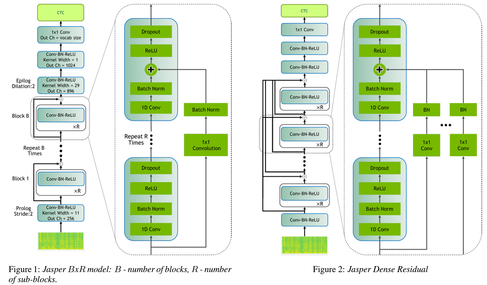

# GSoC 2021 : Speech Recognition using OpenCV

## Overview
Mentor : Liubov Batanina @l-bat \
Proposal for the project : [https://summerofcode.withgoogle.com/projects/#5148521881141248](https://summerofcode.withgoogle.com/projects/5148521881141248)\
Link for Pull Request : [https://github.com/opencv/opencv/pull/20291](https://github.com/opencv/opencv/pull/20291)

OpenCV is used extensively in computer vision, tackling almost all major computer vision problems. Many Modern CV applications require working with videos, which are essentially images(frames) stacked on top of each other. Potential applications can also include working with audio along with video frames. OpenCV currently doesn’t provide support for such applications out of the box. The goal of this project is to add speech recognition samples, to be used with the OpenCV DNN module, to provide out of the box support speech recognision applications.

## Introduction to the DL model
Jasper: An End-to-End Convolutional Neural Acoustic Model ([arXiv:1904.03288 [eess.AS]](https://arxiv.org/pdf/1904.03288.pdf)) is the model used here. According to the paper, A Jasper Model consists of several jasper blocks with 1 pre and 3 post conv layers. A Jasper BxR model has B blocks, each with R subblocks. Each sub-block applies the following operations: a 1Dconv, batch norm, ReLU, and dropout. All sub-blocks in a block have the same number of output channels. Each block input is connected directly into the last subblock via a residual connection. The residual connection is first projected through a 1x1 convolution to account for different numbers of input and output channels, then through a batch norm layer. The output of this batch norm layer is added to the output of the batch norm layer in the last sub-block. The result of this sum is passed through the activation function and dropout to produce the output of the current block. Follwong image from the paper describes the architecture of the model:

\
The input to this model is mel filterbank energy features calculated from single channeled audio data. The output of the model is of the shape `(batch, frames, 28)` where frames is the number of frames processed (of 10ms). This contains the probabilities of each character(a - z, " and a blank). The transcript of the audio is produced by decoding this output.

## Objectives
The objectives were:
* use NVIDIA's pre-trained jasper model to create an onnx model compatible with OpenCV DNN
* Addition of OpenCV sample sample of Jasper
* Comparing the results from OpenCV sample and original model

## Implementation details
### Creating ONNX model
OpenCV DNN module can read the dnn model from an onnx file which contatins the computation graph in the form of nodes describing the operation being performed and the weights and initializers for every node. However, OpenCV doesn't support 16 bit floating point numbers and the jasper was trained by NVIDIA with FP16 precision. The model needs to be converted to FP32 precision before it can be used in OpenCV. The conversion was done by iterating over every node and changing the data type of every value of each node to FP32. Apart from this, the weights are stored by the onnx file format as binary data with their data type, which can be read while creating the model object. We had to change this binary data as well. This was done using `numpy_helper` from the `onnx` module. We also had to add a reshape node befor any other operation, this was to ensure input had correct shape (this was a work around for [https://github.com/opencv/opencv/issues/19091](https://github.com/opencv/opencv/issues/19091)).\
The code to convert the model can be found here: [convert_jasper_to_FP32.py](https://gist.github.com/spazewalker/507f1529e19aea7e8417f6e935851a01).

### Creating OpenCV sample
#### Pre-processing
The jasper needs more than just an pre-trained onnx model to work. Filterbank Features needs to be calculated by appling a Short Time Fourier Transform to the raw audio to produce small frames. This is done using `FilterbankFeatures` class which is based upon [Librosa](https://librosa.org/). The workflow of the pre-processing comprises of dethering and using pre-emphasis on the raw audio signal, followed by calculating a short time fourier transform, which is then used to calculate the "power spectrum" i.e. the magnitude of the complex values.These are then multiplied with the mel filterbanks. Taking the log values of this, gives the final input matrix for Jasper Model. Complete code can be found in the [Pull Request](https://github.com/opencv/opencv/pull/20291).
#### Model
The model is read by opencv dnn module. Which is then forwarded using the matrix that we calculated earlier. The process is pretty straight forward for this, we read the onnx file, load the model, set input, target and backend, and forward. However this was delayed due to a bug. OpenCV does all it's computation in C++. These C++ functions are wrapped by python bindings to enable the use of OpenCV in python. Opencv python bindings treat the 3 dimentional matrices as images and wraps them to simulate the channels while passing them from python to C++. Max number of channels supported is 512. So, any matrix with a shape `(x,y,<=512)` is converted to `(x,y)`. This causes a problem with the audios short enough to have features with this shape. The corresponding issue can be found at [https://github.com/opencv/opencv/issues/19091](https://github.com/opencv/opencv/issues/19091). Current work-around is to add a dummy dimention to change the shape from `(x,y,z)` to `(x,y,z,1)`. I came up with a [solution](https://github.com/opencv/opencv/pull/20462), which wasn't a stable fix. But thanks to @alalek, this will be fixed in the future, refer [https://github.com/opencv/opencv/pull/20558](https://github.com/opencv/opencv/pull/20558).
#### Post-processing
The model gives the "probabilities" of each for each window of the given audio. We need to produce a transcript of the given audio. This is done by applying a CTC-decoding algorithm on the output in `Decoder` class.

## What does this repo contain?
This repository contains the Jupyter notebooks that were used to experiment with the code along with some scripts to make life easier. The `build.sh` script is used to build opencv from source on linux in debug config with single command `sudo sh build.sh`. `transcript.txt` contains the transcript of the audio `audio.flac` generated using OpenCV sample.
